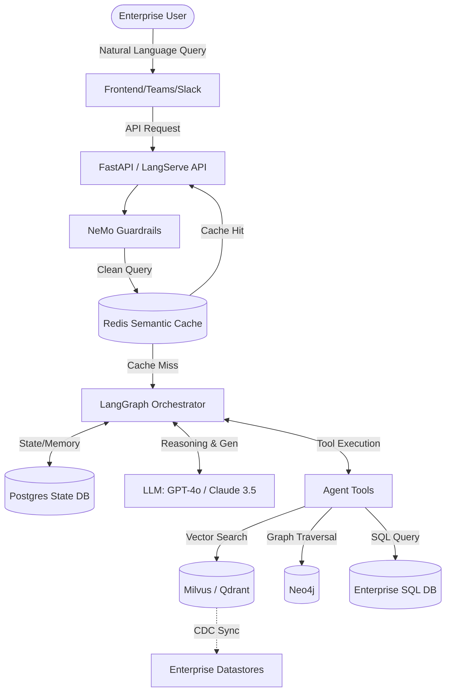
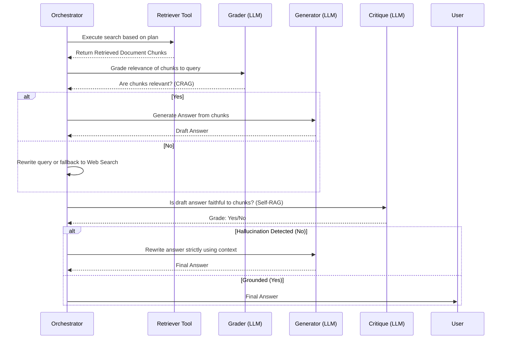

# Enterprise Agentic RAG Architecture Blueprint 

## Executive Summary & Business Value
This document serves as the foundational architecture guide for deploying an **Enterprise-Grade Agentic Retrieval-Augmented Generation (RAG)** system. Unlike early-generation "ChatGPT wrappers" that suffer from hallucinations, data leakage, and unpredictability, this architecture utilizes cyclical LangGraph reasoning to introduce strict quality control, self-correction, and Role-Based Access Control (RBAC). 

**Key Business Outcomes:**
- **Zero Data Leakage:** Deep integration of RBAC ensures users only query data they physically have clearance to see.
- **Maximized Accuracy (CRAG/Self-RAG):** Multi-agent grading dramatically mitigates hallucination risk, protecting brand reputation and enabling deployment in high-compliance environments.
- **Deterministic Scalability:** Microservice-based deployment and Semantic Caching drastically reduce token costs and API latencies.

This comprehensive blueprint details the technical implementation strategies necessary to achieve these outcomes using LangChain and LangGraph.

---

## Phase 1: Advanced Data Ingestion & Indexing
The foundation of any RAG system. If the data is poorly structured at ingestion, the retrieval agent will fail regardless of how advanced its reasoning capabilities are.

### 1.1 Chunking Strategy: Semantic / Document-Aware Chunking
* **Priority:** High
* **Description:** Move away from naive, fixed-character token splitting (e.g., splitting every 1000 tokens). Enterprise documents have inherent structure that must be preserved.
* **Implementation Details:** * Use document parsers (like Unstructured.io or LlamaParse) to identify logical boundaries.
  * Extract and isolate tabular data from complex documents (like bank statements or financial risk policies) and process them separately from standard text paragraphs.
  * Retain metadata (e.g., Header 1, Header 2) within the chunk so the LLM understands where the excerpt originated within the broader document hierarchy.

### 1.2 Indexing: Multi-Vector Representation (Parent-Child)
* **Priority:** High
* **Description:** Optimize for both searchability and context preservation by separating the search embedding from the generation context.
* **Implementation Details:** * Use LangChain's `ParentDocumentRetriever`.
  * **Child Chunks:** Generate small, dense embeddings (e.g., summaries or 200-word snippets) optimized for high-accuracy vector search.
  * **Parent Chunks:** When a child chunk is matched, return the larger, un-truncated parent document to the LLM. This ensures the model has the full surrounding context to generate a nuanced answer.

### 1.3 Advanced Context: Knowledge Graph Integration (GraphRAG)
* **Priority:** Medium
* **Description:** Vector databases struggle with relationships and multi-hop reasoning. Knowledge graphs map connections between discrete entities.
* **Implementation Details:** * Extract entities and relationships during ingestion (e.g., mapping a specific candidate's skills to various job requirements, or linking a specific risk factor across multiple disconnected loan documents).
  * Store in a graph database (like Neo4j).
  * Combine vector similarity search with graph traversal to answer questions like, "How does the risk policy update from Q2 affect the dynamic pricing parameters for Tier A loans?"

### 1.4 Multimodal Ingestion (Vision & Tables)
* **Priority:** High
* **Description:** Enterprise documents (e.g., financial reports) rely on charts, graphics, and tables that standard text chunking corrupts.
* **Implementation Details:** * Process images through a Vision Language Model (VLM like GPT-4o) to generate rich text descriptions prior to embedding.
  * Alternatively, implement late-interaction multimodal models (like ColPali) to natively embed and retrieve visual document patches.

### 1.5 Data Lineage & Lifecycle Management
* **Priority:** High
* **Description:** Enterprise policies are updated and deprecated constantly; the vector index must stay perfectly synchronized.
* **Implementation Details:** * Assign strict Document UUIDs and version numbers at the index level.
  * Build an automated Change Data Capture (CDC) pipeline to purge deprecated vector chunks when the source document in SharePoint/Confluence is deleted or overwritten.

### 1.6 Intelligent Metadata Extraction
* **Priority:** Medium
* **Description:** Enrich documents intelligently to power strict Role-Based Access Control (RBAC) and faceted search.
* **Implementation Details:** * Pass documents through a lightweight LLM during ingestion to automatically tag them with domain-specific metadata (e.g., "Document_Type: Policy", "Clearance: Tier_1", "Effective_Date").

---

## Phase 2: Pre-Retrieval (Intelligent Query Processing)
Never trust the raw user prompt. Agents must interpret, route, and optimize queries before touching the database.

### 2.1 Orchestration: Semantic Routing
* **Priority:** High
* **Description:** Use a lightweight classifier layer to determine the most efficient data source for the query.
* **Implementation Details:** * Implement tools using LangGraph conditional edges.
  * If the query is analytical (e.g., pulling live dynamic pricing numbers or calculating risk adjustments), route to a SQL Database Tool.
  * If the query is policy-based, route to the Vector DB Tool.
  * If the query requires current events, route to a Web Search API (like Tavily).

### 2.2 Query Optimization: Query Transformation
* **Priority:** High
* **Description:** Overcome the vocabulary mismatch problem between user queries and stored documents.
* **Implementation Details:** * **Query Expansion (Multi-Query):** Use a fast LLM to generate 3-4 synonymous variations of the user's prompt to cast a wider semantic net.
  * **Query Decomposition:** Break down complex, multi-part questions into parallel sub-queries (e.g., splitting "What is the candidate's background in Python and how did they perform on the system design test?" into two distinct searches).
  * **Step-Back Prompting:** Prompt the LLM to generate a broader, more generic conceptual question to retrieve foundational context before answering the specific query.

### 2.3 Security: Input Guardrails & Validation
* **Priority:** Critical
* **Description:** Protect the enterprise from adversarial prompt injections and prevent sensitive data leaks before the LLM is even invoked.
* **Implementation Details:** * Route incoming queries through an immediate validation node (using NeMo Guardrails or Llama Guard).
  * Automatically detect and obfuscate/mask PII (e.g., SSNs, Account Numbers) from the prompt before it hits external LLM APIs.

### 2.4 Performance: Semantic Caching
* **Priority:** High
* **Description:** Eliminate redundant LLM calls and Vector DB queries for frequently asked enterprise questions (e.g., "What is the Q3 holiday schedule?").
* **Implementation Details:** * Implement a semantic caching layer (like Redis with vector search or GPTCache).
  * Check if the incoming query has a high cosine similarity (>0.95) to a previously answered question. If yes, return the cached result instantly, saving massive token costs.

---

## Phase 3: Agentic RAG (LangGraph Core)
Transforming linear retrieval into a cyclical reasoning engine using state machines.

### 3.1 LangGraph State: Robust `TypedDict` State Management
* **Priority:** High
* **Description:** Define the global memory object that persists as the agent traverses different nodes.
* **Implementation Details:** * Create a `State` class containing:
    * `messages`: The conversation history (Human and AI messages).
    * `context`: A list of retrieved `Document` objects.
    * `current_plan`: The agent's step-by-step reasoning.
    * `error_flags`: Booleans for workflow routing (e.g., `needs_web_search`, `hallucination_detected`).

### 3.2 Error Handling: Corrective RAG (CRAG)
* **Priority:** High
* **Description:** An autonomous quality-control gate immediately following document retrieval.
* **Implementation Details:** * Build an evaluator node that grades the retrieved chunks against the original query.
  * If the chunks are graded as irrelevant, the graph dynamically drops the bad documents.
  * Trigger a fallback action: either rewrite the query and search the Vector DB again, or default to a web search tool.

### 3.3 Quality Control: Self-RAG (Faithfulness Checks)
* **Priority:** High
* **Description:** Prevent hallucinations by fact-checking the generated answer before it reaches the user.
* **Implementation Details:** * After the generation node, route to a critique node.
  * Ask an LLM: "Is this generated answer strictly grounded in the provided retrieved context?"
  * If NO (hallucination), the graph loops back to the generation node with instructions to rewrite the answer using only the provided facts.

### 3.4 Architecture: Multi-Agent Supervisor Pattern
* **Priority:** Medium
* **Description:** Avoid "monolithic prompts" by delegating complex workflows to specialized, narrowly scoped worker agents.
* **Implementation Details:** * **Worker 1 (Researcher):** Dedicated strictly to retrieving and summarizing documents.
  * **Worker 2 (Analyst):** Dedicated to executing complex calculations (e.g., risk-adjustment math, dynamic interest rate modeling).
  * **Supervisor:** Analyzes the user request, delegates tasks to the workers, compiles their outputs, and formats the final response.

### 3.5 Memory Tiers: Context Window Compression & Persistence
* **Priority:** High
* **Description:** Handle both cross-session persistence and preventing intra-session context window limits (preventing massive token bloat during long conversations).
* **Implementation Details:** * Integrate persistent checkpointers (LangGraph Checkpoint Postgres) to strictly save thread state.
  * Introduce a **Rolling Context Compression** node: When a thread exceeds 10 turns, automatically spawn a lightweight LLM to summarize the older messages into a dense paragraph, maintaining context while saving 80% of token overhead.
  * Add a Long-Term Memory semantic layer (e.g., Mem0 or Zep) to extract and persist core entity facts about the user across completely distinct sessions.

### 3.6 Tool Calling Reliability: Strict Structured Outputs
* **Priority:** High
* **Description:** Multi-agent workers must execute external tool calls predictably without hallucinating arguments.
* **Implementation Details:** * Enforce strictly typed schema definitions (e.g., Pydantic) for every tool definition.
  * Utilize the `with_structured_output` LLM binding to mathematically guarantee the LLM's response adheres to the JSON schema required by the API.

---

## Phase 4: Post-Retrieval Optimization
Refining the retrieved context to maximize LLM performance and minimize token usage.

### 4.1 Search Strategy: Hybrid Search
* **Priority:** High
* **Description:** Ensure neither semantic meaning nor exact keyword matches are lost.
* **Implementation Details:** * Combine Dense Vector Search (cosine similarity for contextual understanding) with Sparse Keyword Search (BM25 for exact matches).
  * Essential for queries involving specific candidate IDs, specific loan application numbers, or technical acronyms that vector search might blur.

### 4.2 Ranking: Reciprocal Rank Fusion (RRF) & Reranking
* **Priority:** High
* **Description:** The process of merging results from different search algorithms and promoting the most relevant chunks to the top.
* **Implementation Details:** * Use RRF to mathematically merge the ranked lists from Vector and BM25 searches.
  * Pass the top 20 blended results through a Cross-Encoder model (like Cohere Rerank). Cross-encoders compare the query directly against each document simultaneously, providing a highly accurate relevancy score to surface the absolute best 3-5 chunks.

### 4.3 Token Management: Contextual Compression
* **Priority:** Medium
* **Description:** Mitigate "Lost in the Middle" syndrome by distilling retrieved documents down to their core facts.
* **Implementation Details:** * Instead of passing entire document chunks to the final generation node, pass them through a fast, lightweight LLM (or a tool like LLMLingua).
  * Instruct the compressor to extract *only* the specific sentences or data points that directly answer the query, discarding fluff and saving significant context window space.

### 4.4 Advanced Ranking: Dynamic Time-Based Boosting
* **Priority:** High
* **Description:** Enterprise policies (like pricing or HR rules) change. Newer policies must override older documents even if they are semantically similar.
* **Implementation Details:** * Inject time-decay functions or date filters into the final retrieval ranking.
  * Mathematically boost the relevancy score of chunks if their `Effective_Date` metadata is recent.

### 4.5 Advanced Ranking: Late Interaction Models (ColBERT)
* **Priority:** High
* **Description:** Address the latency bottleneck of standard Cross-Encoder reranking at enterprise scale.
* **Implementation Details:** * Implement Late Interaction models (like ColBERT) to achieve the accuracy of a cross-encoder but with drastically faster retrieval speeds over millions of documents.

---

## Phase 5: Enterprise Governance & Operations
Ensuring the system is secure, compliant, and measurable in a production environment.

### 5.1 Security: Role-Based Access Control & Multi-Tenancy
* **Priority:** High
* **Description:** Prevent data leakage across different clearance tiers and distinct enterprise tenants.
* **Implementation Details:** * For internal access tiers, inject **Logical Separation** (strict metadata filters into the vector database query, e.g., `filter={"clearance_level": "Tier_1"}`).
  * For B2B multi-tenancy SaaS models, implement **Physical Separation** (create uniquely provisioned Vector DB collections and separate Postgres schema paths per tenant) to guarantee zero cross-contamination of isolated data.
  * Ensure user identities and access tiers are strictly passed via secure OIDC/SAML tokens in the session state.

### 5.2 Compliance: Human-in-the-Loop (HITL) Intervention
* **Priority:** Medium
* **Description:** Provide human oversight for critical agentic decisions.
* **Implementation Details:** * Utilize LangGraph's `interrupt_before` or `interrupt_after` functionality.
  * Pause graph execution before the agent finalizes a high-stakes action (e.g., before an AI virtual interviewer officially finalizes a candidate's score, or before an automated pricing engine locks in a finalized loan interest rate).
  * Wait for a human API call to approve or reject the state before resuming.

### 5.3 Observability: Distributed Tracing
* **Priority:** High
* **Description:** Debugging autonomous loops requires visibility into every step of the graph.
* **Implementation Details:** * Integrate LangSmith (or alternatives like Datadog or Phoenix).
  * Track exact execution paths, monitor the specific prompts generated at each node, track token usage/latency per step, and quickly identify where a self-correction loop (like CRAG) got stuck in an infinite cycle.

### 5.4 Evaluation: Synthetic Data & CI/CD Metrics
* **Priority:** High
* **Description:** Replace manual "vibe checks" with mathematically measured testing frameworks and automated datasets.
* **Implementation Details:** * Utilize strong LLMs to automatically generate a **Synthetic "Golden Dataset"**. As new documents are ingested, parse them through an LLM to automatically generate 5 complex "Question & Expected Answer" pairs to scale test coverage without human effort.
  * Integrate evaluation frameworks like RAGAS or TruLens into your deployment pipeline.
  * Continuously measure key metrics against the Golden Dataset: **Context Precision** (did we retrieve the right things?) and **Faithfulness** (did the LLM hallucinate?).

### 5.5 FinOps: Cost Tracking & Rate Limiting
* **Priority:** Critical
* **Description:** Multi-Agent Self-RAG loops consume immense token volumes quickly. Unchecked, this drives runaway cloud costs.
* **Implementation Details:** * Track token consumption accurately per LangGraph run and attribute it to specific tenant/user IDs.
  * Implement strict API rate limiting per operational unit (e.g., HR tier gets 10M tokens/month).

### 5.6 Data Sovereignty & Model Deployment
* **Priority:** High
* **Description:** Guarantee that top-secret enterprise data is physically secured based on corporate policy.
* **Implementation Details:** * If using public endpoints (Azure OpenAI, Anthropic), verify zero-retention API agreements and pre-mask PII.
  * Provide an architectural pathway for routing the highest-security data to local open-weight models (e.g., Llama 3 70B deployed internally via vLLM).
  * Expose the final agentic graph via FastAPI/gRPC or LangServe to integrate securely into enterprise frontends like Microsoft Teams or internal portals.

### 5.7 Decoupled Prompt Management (CMS)
* **Priority:** Medium
* **Description:** Remove prompts from application source code to unblock domain experts from tuning agent personas.
* **Implementation Details:** * Integrate an external Prompt Hub (like LangSmith Prompts or Promptfoo). 
  * Allow Legal, HR, or Ops teams to log into a UI to tweak the exact instructions of the "Analyst Agent" without requiring a Git Pull Request or engineering redeployment.

---

# Part II: Architectural Reference Guide

## 6. System Context & Flow Architecture
Visualizations of the system's external boundaries and the internal LangGraph reasoning loop.

### 6.1 Enterprise RAG Context Diagram


### 6.2 Agentic Reasoning Loop (CRAG / Self-RAG)


## 7. Prescriptive Technology Stack
The approved stack choices for enterprise scalability and their justifications:

* **Vector Database: Milvus or Pinecone Serverless**
  * *Why:* Requires native RBAC at the collection level, horizontal scalability to billions of vectors, and sub-millisecond latency for hybrid search (Vector + BM25).
* **Graph Database: Neo4j**
  * *Why:* Industry standard for GraphRAG, excellent Cypher query support, and integration with LangChain's GraphQA chains.
* **Orchestration: LangGraph**
  * *Why:* Provides cyclical, stateful flows using `TypedDict`. Allows for easy human-in-the-loop pauses and deterministic flow required for compliance, unlike AutoGen.
* **Foundational Models:**
  * *Routing / Grading (Fast):* Claude 3.5 Haiku or GPT-4o-mini.
  * *Reasoning / Generation (Heavy):* Claude 3.5 Sonnet or GPT-4o.
  * *High Security/Air-Gapped:* Llama 3 70B deployed via vLLM on local Kubernetes.

## 8. Data Schemas & API Contracts
Concrete data structures underpinning the framework.

### 8.1 LangGraph State Schema (`TypedDict`)
```python
from typing import Annotated, Sequence, TypedDict
from langchain_core.messages import BaseMessage
import operator

class AgentState(TypedDict):
    # Conversation history
    messages: Annotated[Sequence[BaseMessage], operator.add]
    # Tenant info for RBAC filtering
    tenant_id: str
    clearance_level: str
    # Context arrays
    context: list[str]
    # Routing flags
    needs_rewrite: bool
    hallucination_detected: bool
    # Tool tracking
    tool_invocations: int
```

### 8.2 Vector Chunks Metadata Schema
```json
{
  "chunk_id": "uuid-1234",
  "document_id": "doc-uuid-5678",
  "text": "The Q3 remote work policy stipulates...",
  "metadata": {
    "document_type": "HR_Policy",
    "effective_date": "2025-07-01",
    "clearance_level": "Tier_1",
    "department": "Human_Resources"
  }
}
```

## 9. Infrastructure, Deployment & Scaling
DevOps overview for production environments.

* **Containerization:** The LangGraph API MUST be containerized using Docker, with dependencies managed via Poetry or uv. 
* **Kubernetes Orchestration:** Deploy stateless API pods to EKS/AKS. The vector database and Postgres checkpointer should be managed services (e.g., Pinecone, AWS RDS) or deployed via Helm charts with persistent volumes.
* **GPU Allocation:** If hosting local LLMs via vLLM, provision GPU nodes (e.g., AWS `p4d.24xlarge` with A100s). Implement continuous batching for high throughput.
* **Semantic Cache:** Deploy Redis Enterprise for high-availability caching across availability zones.

### 9.1 LLM Gateway & Load Balancing
Centralized control over external API calls ensures reliability and cost safety.
* **Gateway Layer:** Route all LLM API calls through an intermediate gateway (e.g., **LiteLLM**, **Cloudflare AI Gateway**, or **Kong**). 
* **Capabilities:** Implement active load balancing across multiple Azure OpenAI regions, fallback routing (e.g., route to Claude 3.5 if GPT-4o timeouts), and centralized API Secret management (so LangChain never holds the raw API key).

### 9.2 Developer Onboarding & Local Setup
Guidelines for engineering the local development loop.
* **State Debugging:** Developers should use **LangGraph Studio** connected to a local Dockerized LangGraph API server. This provides a visual interface to step through state changes and replay agent reasoning visually.
* **Local Checkpointing:** Spin up a lightweight local Postgres container (via `docker-compose`) to test persistent memory cross-session before pushing to RDS.
* **Cost-Free Dev Models:** For local routing and simple extraction tests, developers should use `Ollama` hosting `Llama-3-8B` locally to avoid consuming expensive OpenAI/Anthropic API credits during initial feature buildout.

## 10. Non-Functional Requirements (NFRs) & SLAs
Engineering constraints for the architecture.

* **Latency Budgets:**
  * Semantic Caching Hit: < 50ms
  * Routing Classification: < 300ms
  * First Token Generated (TTFT): < 1.5 seconds
* **Security Perimeters:**
  * No corporate data travels over the public internet. Use Azure Private Link or AWS PrivateLink to connect VPCs directly to hyperscaler LLM endpoints.
* **Reliability:**
  * API endpoints must maintain 99.9% uptime.
  * Vector Database backups must happen daily, with point-in-time recovery enabled.

### 10.1 Failure Modes & Graceful Degradation Matrix
Enterprise systems must anticipate failures in underlying dependencies.
* **LLM Provider Outage (e.g., OpenAI down):** The LangGraph orchestrator should catch the 500 error, bypass generation, and return the raw top-3 Vector chunks to the user with a "Synthesized answers temporarily degraded" banner.
* **Vector DB Outage:** Fall back exclusively to the Semantic Cache layer for read-only access to highly frequent queries. Suspend ingestion/CDC pipelines automatically.
* **Semantic Cache Failure:** Route all queries standardly through the LLM. Expected behaviour: Temporary latency spike, but zero loss of functionality.

---

# Part III: Forward-Looking Roadmap & Next-Gen Capabilities

As the enterprise AI landscape rapidly evolves, the following technologies and architectural patterns represent the next frontier of this framework. They should be considered for subsequent major iterations.

## 11. Read/Write Action Agents (beyond RAG)
Currently, this architecture focuses exclusively on retrieval (Read). The next phase of agentic integration is executing secure, transactional actions (Write).
* **Action Routing:** Introduce new "Action Tools" in LangGraph (e.g., submitting a formal Helpdesk ticket, executing a Salesforce update, or processing an HR PTO request).
* **Delegated Auth:** Implement robust OAuth 2.0 delegated authentication schemes ensuring the `AgentState` carries the physical user's access token, preventing elevation of privilege attacks.

## 12. Auto-Optimization & DSPy Integration
Prompt engineering today is largely manual. Future iterations should automate prompt tuning.
* **Algorithmic Prompts:** Integrate frameworks like **DSPy** to mathematically optimize the agent’s prompts, instructions, and few-shot examples automatically based on historical trace data and CI/CD test failures.

## 13. Federated RAG (Data Mesh)
Enterprises rarely centralize all data into a single Vector Database. Data is inherently federated across Snowflake, Databricks, and internal file shares.
* **Federated Router:** Expand the Semantic Router to query disparate enterprise datastores simultaneously in parallel (e.g., leveraging Snowflake Cortex or Databricks Unity Catalog) instead of forcing strict data gravity into a central vector store.

## 14. Continuous RLHF & Fine-Tuning Loop
Establish a continuous learning pipeline fed directly by end-users.
* **Data Flywheel:** Capture feedback directly from the UI (e.g., user thumb-downing an answer). Save that specific execution trace from LangSmith into a structured dataset.
* **Model Distillation:** Periodically use this high-quality, curated dataset to fine-tune smaller, cheaper open-weight models (like Llama 3 8B) to replace expensive API calls (GPT-4o) for domain-specific tasks without sacrificing latency or quality.

## 15. Automated AI Security Red Teaming
As defenses like NeMo Guardrails are implemented, they must be rigorously tested.
* **Adversarial Pipeline:** Integrate an automated Red Teaming pipeline in staging. Before any new version of the LangGraph orchestrator is pushed to production, spin up an "Attacker Agent" specifically engineered to generate prompt injections, jailbreaks, and data extraction attempts (mapping to the OWASP Top 10 for LLMs) to continuously validate your perimeter security.

---

# Part IV: Appendix

## A. Glossary of AI & RAG Terms
For non-technical stakeholders reading this document, here are standard definitions:
* **CRAG (Corrective RAG):** An agentic pattern where an LLM evaluates the quality of retrieved documents *before* answering, triggering a rewrite/fallback if the documents are poor.
* **Self-RAG:** An agentic pattern where an LLM fact-checks its own drafted answer against the source documents to prevent hallucination *before* sending it to the user.
* **BM25:** A classic "keyword search" sparse algorithm (used by Elasticsearch), often combined with Vector search for high accuracy.
* **GraphRAG:** Combining a Knowledge Graph (like Neo4j) with Vector search to answer multi-hop, highly relational business questions.
* **RRF (Reciprocal Rank Fusion):** A mathematical formula used to blend search results from two different search engines (e.g., BM25 and Vector) fairly.
* **Late Interaction (ColBERT):** A highly advanced retrieval method that is faster than standard Cross-Encoders, providing Google-level search accuracy over millions of documents in milliseconds.
* **HitL (Human-in-the-Loop):** Pausing the AI workflow until a human explicitly approves an action.
* **RBAC (Role-Based Access Control):** Ensuring the AI only reads data that the specific querying employee is allowed to see.